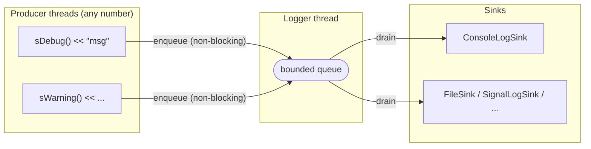

# Logging

This guide explains the SNFCore logging system: how to emit messages from your
code, how to configure the central logger, and how to plug in custom output
destinations (sinks).

---

## Overview

The logging system has three layers:



- **Producers** are your application threads. Logging is always non-blocking:
  messages are pushed onto a bounded queue and the call returns immediately.
- **The logger** runs a single background thread that drains the queue and
  delivers each `LogMessage` to all registered sinks in order.
- **Sinks** receive the fully-formed message and write it wherever they want —
  to stderr, a file, a network stream, or re-emit it as a signal.

---

## Quick start

```cpp
#include <SNFCore/Application.h>
#include <SNFCore/Logging.h>

int main(int argc, char** argv)
{
    snf::Application app(argc, argv);

    sDebug()    << "application started";
    sInfo()     << "listening on port " << 9000;
    sWarning()  << "retry " << attempt << " of " << maxRetries;
    sError()    << "connection refused: " << errorMsg;
    sCritical() << "unrecoverable state, shutting down";

    return app.run();
}
```

Each macro constructs a temporary `LogEntryBuilder`. Text is accumulated
through `operator<<` and submitted to the logger when the temporary is
destroyed at the end of the statement.

The default configuration:
- minimum level: **Debug** (all messages pass)
- output: stderr, formatted as `<timestamp> [LEVEL] (thread-id) file:line func: text`

---

## Macros

| Macro | Level |
|---|---|
| `sDebug()` | `LogLevel::Debug` |
| `sInfo()` | `LogLevel::Info` |
| `sWarning()` | `LogLevel::Warning` |
| `sError()` | `LogLevel::Error` |
| `sCritical()` | `LogLevel::Critical` |

All macros capture `__FILE__`, `__LINE__`, and `__func__` automatically.

---

## Runtime configuration

Access the logger through `Application::instance()->logger()`:

```cpp
snf::Logger& log = app.logger();

// Suppress Debug and Info messages at runtime.
log.setLevel(snf::LogLevel::Warning);

// Wait until the queue drains (useful before a clean shutdown).
log.flush(std::chrono::milliseconds(200));

// Inspect counters.
snf::LoggerStats s = log.stats();
// s.enqueued  — messages accepted into the queue
// s.processed — messages delivered to sinks
// s.dropped   — messages discarded because the queue was full
```

### Queue capacity

The queue is bounded. The default capacity is 8 192 messages. If the queue fills
up, the incoming message is silently dropped and `stats().dropped` is
incremented — producers are never blocked.

To change the capacity, construct the `Logger` directly (standalone usage):

```cpp
snf::Logger logger(/*queueCapacity=*/32768);
```

When using `Application` the logger is created with the default capacity. If
your workload generates bursts larger than 8 192 messages before the consumer
can drain them, add a custom sink that writes asynchronously to a file.

---

## Sinks

### Built-in sinks

| Class | Header | Description |
|---|---|---|
| `ConsoleLogSink` | `<SNFCore/ConsoleLogSink.h>` | Writes to stderr (installed by default) |
| `SignalLogSink` | `<SNFCore/SignalLogSink.h>` | Re-emits each message as `Signal<const LogMessage&>` |

### Writing a custom sink

Inherit from `LogSink` and implement `consume()`:

```cpp
#include <SNFCore/LogSink.h>
#include <SNFCore/LogMessage.h>
#include <SNFCore/LogLevel.h>
#include <fstream>

class FileSink : public snf::LogSink
{
public:
    explicit FileSink(const std::string& path)
        : m_file(path, std::ios::app)
    {}

    void consume(const snf::LogMessage& msg) override
    {
        // consume() is always called from the Logger's worker thread,
        // so no additional locking is required here.
        m_file << '[' << snf::logLevelToString(msg.level) << "] "
               << msg.text << '\n';
        m_file.flush();
    }

private:
    std::ofstream m_file;
};
```

> `consume()` is called exclusively from the logger's worker thread.
> You do **not** need to guard your sink with a mutex unless the same sink
> instance is shared with code outside the logger.

### Registering a sink

```cpp
auto sink = std::make_shared<FileSink>("app.log");
app.logger().addSink(sink);

// Later, to remove it:
app.logger().removeSink(sink);

// Or replace all sinks at once:
app.logger().clearSinks();
app.logger().addSink(std::make_shared<FileSink>("new.log"));
```

Sinks are stored as `shared_ptr`, so the logger releases ownership when the
sink is removed but any external holder keeps it alive.

---

## Using `SignalLogSink` for reactive forwarding

`SignalLogSink` exposes a `Signal<const LogMessage&>` that you can connect to
any slot — including cross-thread receivers via `ConnectionType::Queued`.

```cpp
#include <SNFCore/SignalLogSink.h>
#include <SNFCore/Connection.h>

// Forward every WARNING and above to a network diagnostics object.
auto signalSink = std::make_shared<snf::SignalLogSink>();

signalSink->messageLogged.connect([](const snf::LogMessage& msg) {
    if (msg.level >= snf::LogLevel::Warning) {
        networkDiag.send(msg.text);
    }
});

app.logger().addSink(signalSink);
```

For a receiver that lives on a different thread, use `ConnectionType::Queued`
so the slot is posted to the receiver's `EventLoop`:

```cpp
snf::NodePtr<DiagNode> ptr(diagNode);
signalSink->messageLogged.connect(ptr, &DiagNode::onLog,
                                  snf::ConnectionType::Queued);
```

See [Thread Affinity](thread-affinity.md) for the full cross-thread pattern.

---

## Standalone usage (without `Application`)

`Logger` can be used independently of `Application`, which is useful in
libraries, unit tests, or tools that do not run an event loop:

```cpp
#include <SNFCore/Logger.h>
#include <SNFCore/ConsoleLogSink.h>

snf::Logger logger;
logger.addSink(std::make_shared<snf::ConsoleLogSink>());
logger.setLevel(snf::LogLevel::Info);
logger.start();

logger.log(snf::LogLevel::Info, "hello from standalone", __FILE__, __LINE__, __func__);

logger.flush();
logger.stop();
```

`stop()` drains the queue and joins the worker thread before returning, so no
messages are lost during shutdown.

---

## `LogMessage` fields

Every message delivered to a sink carries:

| Field | Type | Description |
|---|---|---|
| `sequence` | `uint64_t` | Monotonically increasing counter per logger instance |
| `timestamp` | `system_clock::time_point` | Wall-clock time of emission |
| `level` | `LogLevel` | Severity |
| `text` | `std::string` | Message text built by the stream builder |
| `file` | `const char*` | Source file (`__FILE__`) |
| `line` | `int` | Source line (`__LINE__`) |
| `function` | `const char*` | Function name (`__func__`) |
| `threadId` | `std::thread::id` | Thread that emitted the message |

---

## Third-party library adapters

If you want to route SNFCore logs through an external library such as
**log4cplus**, **spdlog**, or **Boost.Log**, write a thin sink adapter:

```cpp
// Example: route to spdlog
#include <SNFCore/LogSink.h>
#include <spdlog/spdlog.h>

class SpdlogSink : public snf::LogSink
{
public:
    void consume(const snf::LogMessage& msg) override
    {
        switch (msg.level) {
            case snf::LogLevel::Debug:    spdlog::debug(msg.text);    break;
            case snf::LogLevel::Info:     spdlog::info(msg.text);     break;
            case snf::LogLevel::Warning:  spdlog::warn(msg.text);     break;
            case snf::LogLevel::Error:    spdlog::error(msg.text);    break;
            case snf::LogLevel::Critical: spdlog::critical(msg.text); break;
        }
    }
};
```

Then remove the default console sink if the external library already handles
console output:

```cpp
app.logger().clearSinks();
app.logger().addSink(std::make_shared<SpdlogSink>());
```
